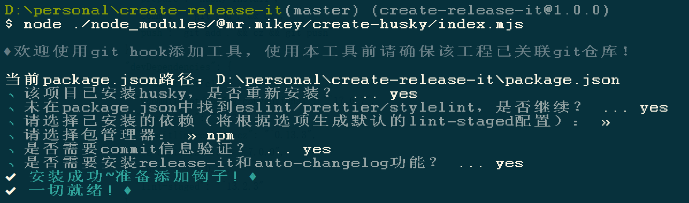

# @mr.mikey/create-husky

## 说明

做项目基建时需要对团队成员commit-msg进行规范化限制，一般采用业界公认的angular提交规范，为了避免繁琐无聊的配置，将这个过程做成了npm包，通过安装包执行命令即可一键在项目中生成配置，并通过husky来创建git hook限制提交msg格式。

初始化完成后输入 `npm run commit` 在cmder终端演示效果：


为了偷懒，建议安装`yarn`，通过`yarn commit`来运行能少输几个字符

## 使用

安装依赖（用户名没取好，输入命令时记得加上引号）
> npm install "@mr.mikey/create-husky" -D

运行（用户名没取好，输入命令时记得加上引号）
> npm init "@mr.mikey/husky"
> 或者
> node ./node_modules/@mr.mikey/create-husky/index.js

运行 `npm init "@mr.mikey/husky"` 演示效果：



## 自动生成&修改文件

package.json 会新增以下内容

```json
"scripts": {
  "prepare": "husky install",
  "commit": "git add . && cz",
  "push": "git add . && cz && git push"
},
"devDependencies": {
  "@commitlint/cli": "^17.6.7",
  "@commitlint/config-conventional": "^17.6.7",
  "commitizen": "^4.3.0",
  "commitlint-config-cz": "^0.13.3",
  "cz-customizable": "^7.0.0",
  "husky": "^8.0.3",
  "lint-staged": "^13.2.3"
}
```

scripts说明

| 依赖    | 说明                                                           |
| ------- | -------------------------------------------------------------- |
| prepare | npm install时自动触发husky安装，保证团队内成员都能使用         |
| commit  | 快捷触发终端交互选择规范commit msg命令，将文件推送到本地仓库   |
| push    | 快捷触发终端交互选择规范commit msg命令，将文件推送到远端版本库 |

devDependencies说明

| 依赖                            | 说明                                                                                             |
| ------------------------------- | ------------------------------------------------------------------------------------------------ |
| @commitlint/cli                 | commitlint基础，对commit-msg进行校验，不符合angular规范的commit信息将不允许提交                  |
| @commitlint/config-conventional | 用于commitlint验证msg是否符合angular规范                                                         |
| commitizen                      | 友好的终端交互工具，输入命令即可自由选择符合angular规范的commit信息                              |
| commitlint-config-cz            | 用于cz的commitlint可共享配置文件可自定义（用于常规提交和常规变更日志的可自定义Commitizen适配器） |
| cz-customizable                 | 自定义汉化commitizen，提供符合国人喜好的中文配置                                                 |
| husky                           | git hook工具                                                                                     |
| lint-staged                     | 仅对commit的文件做lint校验工具                                                                   |

根目录下新增文件

- lint-staged.config：lint-staged配置模板，可自行修改
- .cz-config.js：自定义终端汉化交互配置模板，可自行修改
- .commitlintrc.js：commitlint配置模板，可自行修改
